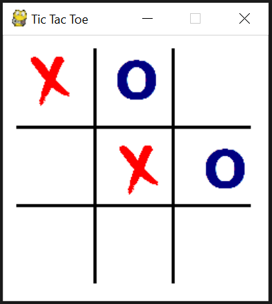

# Tic-Tac-Toe

### About the game
A simple Tic Tac Toe game within easy level in a 3x3 grid

### Screenshot
This is how the game looks like:

### Play it!
You can download the game (Tic.Tac.Toe.zip)from [Release](https://github.com/socolachaymo/Tic-Tac-Toe/releases) and run the TicTacToe.exe file
